<div align="center">

<h1>dhanush777x BSPWM Dotfiles</h1>

**Bspwm · Catppuccin Mocha · Keyboard-Focused Workflow**


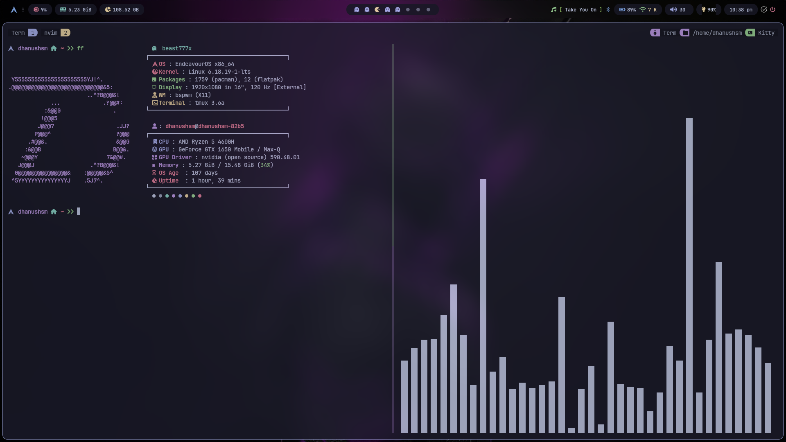

</div>

---

## 🧠 About

This repository contains my personal bspwm dotfiles, built with a strong focus on simplicity, consistency, and keyboard-driven productivity. The setup is intentionally minimal, removing unnecessary complexity while keeping everything fast, predictable, and easy to use.

It is designed around a single cohesive theme - Catppuccin Mocha. Rather than supporting multiple themes, everything is tailored specifically for this palette to maintain visual consistency across the entire system. This keeps the configuration lean and avoids the overhead of theme switching.

The workflow is heavily keyboard-centric. Almost every interaction - window management, application launching, media control, network management, and power options are accessible without relying on a mouse or trackpad.

This setup prioritizes:

- **Speed** - minimal overhead, quick response
- **Consistency** - unified look and behavior across tools
- **Efficiency** - everything reachable from the keyboard

---

## 🚀 Highlights

- **Single theme** - Catppuccin Mocha only. No theme-switcher overhead, no extra assets.
- **Keyboard-first** - the entire workflow is designed to minimize mouse usage. Window management, launching apps, media controls, Network Management, power options - all on the keyboard.
- **Workspace slide animations** - smooth workspace transitions like Hyprland's, powered by [bspwm-slidefx](https://github.com/dhanush777x/bspwm-slidefx) for that polished feel without switching to a Wayland compositor.
- **pwrx** - a clean power management utility. See [pwrx repo](https://github.com/dhanush777x/pwrx) for details.
- **Quality-of-life improvements** - small refinements throughout the setup for a smoother experience

---

## ⌨️ Keybindings

Don't want to dig through config files? Just press:

```
Super + Alt + /
```

This opens a searchable keybindings viewer - you can browse and search all shortcuts from there.

---

## ⚙️ Installation

> **Requires an Arch-based system.**  
> Do **not** run as root.

```bash
git clone https://github.com/dhanush777x/dotfiles.git ~/dotfiles
cd ~/dotfiles
bash install.sh
```

The installer will walk you through everything interactively. Here's what it does:

- Optionally adds **Chaotic-AUR** for faster AUR package builds
- Installs and configures **yay** (AUR helper)
- Installs all required packages
- Installs **pwrx** and **bspwm-slidefx**
- Backs up your existing configs (nothing gets deleted)
- Deploys configs via symlinks
- Enables NetworkManager, Bluetooth, and MPD services
- Sets **Zsh** as your default shell

> - ⚠️ Your existing configs are backed up to `~/.dotfiles_backup/<timestamp>` - not deleted.
> - ⚠️ If your wallpaper appears black, press `Super + Alt + w` to open the wallpaper manager and set one.

---

## 🧩 Stack

| Component            | Tool                      |
| -------------------- | ------------------------- |
| Window Manager       | bspwm                     |
| Hotkey Daemon        | sxhkd                     |
| Bar                  | Polybar                   |
| Compositor           | Picom                     |
| Launcher             | Rofi                      |
| Notifications        | Dunst                     |
| Terminal             | Kitty / Alacritty         |
| Shell                | Zsh                       |
| Editor               | Neovim                    |
| File Manager         | Yazi (TUI) / Thunar (GUI) |
| Music                | mpd + ncmpcpp             |
| Theme                | Catppuccin Mocha          |
| Icons                | Papirus                   |
| Power Utility        | pwrx                      |
| Workspace Animations | bspwm-slidefx             |

---

## 🖼️ Preview

#### 🧠 System / Core

<p align="center">
  <span style="display:inline-block; width:45%; text-align:center;">
    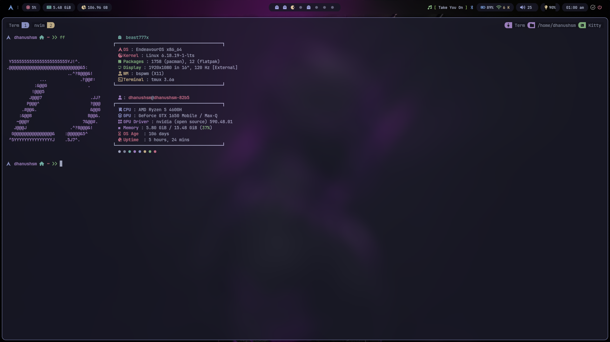<br/>
    <em>Terminal</em>
  </span>
  <span style="display:inline-block; width:45%; text-align:center;">
    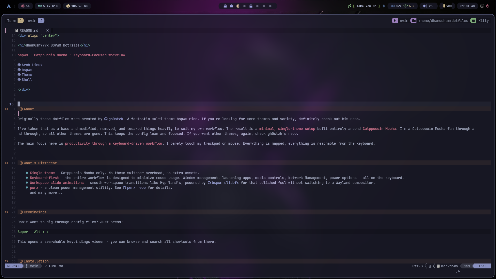<br/>
    <em>Neovim</em>
  </span>
</p>

---

#### ⚙️ Utilities

<p align="center">
  <span style="display:inline-block; width:45%; text-align:center;">
    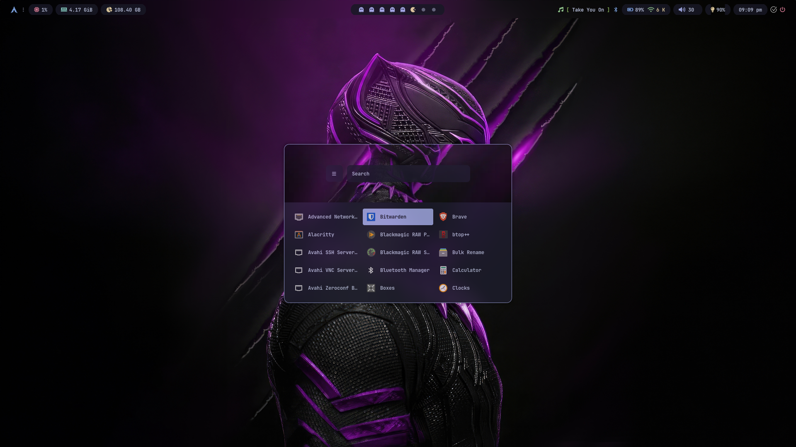<br/>
    <em>Rofi Launcher</em>
  </span>
  <span style="display:inline-block; width:45%; text-align:center;">
    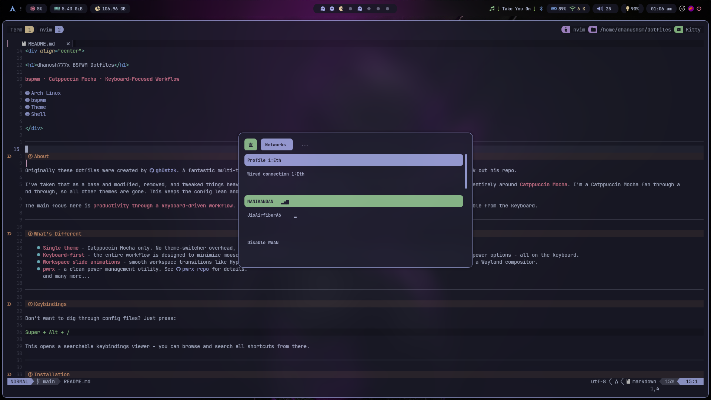<br/>
    <em>Network Manager</em>
  </span>
</p>

<p align="center">
  <span style="display:inline-block; width:45%; text-align:center;">
    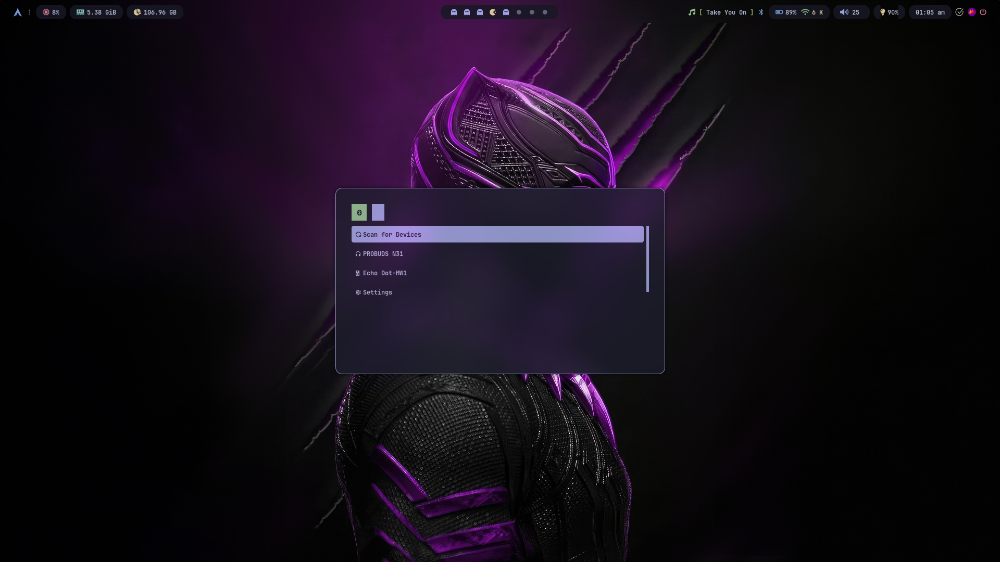<br/>
    <em>Bluetooth Menu</em>
  </span>
</p>

---

#### 🔒 System Controls

<p align="center">
  <span style="display:inline-block; width:45%; text-align:center;">
    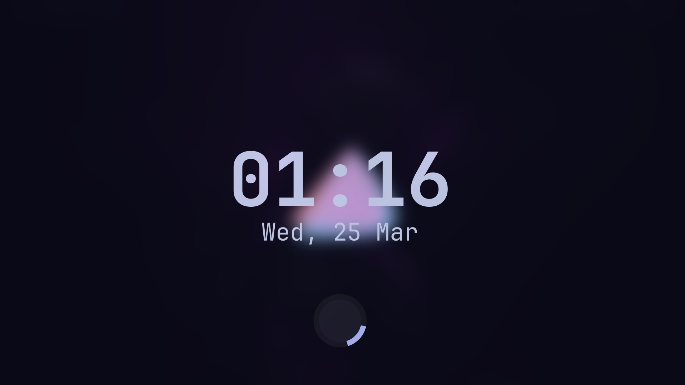<br/>
    <em>Lockscreen</em>
  </span>
  <span style="display:inline-block; width:45%; text-align:center;">
    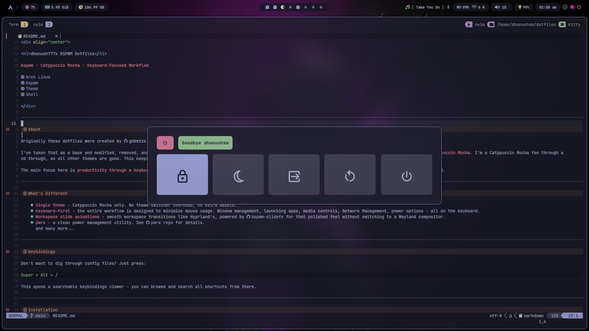<br/>
    <em>Power Menu</em>
  </span>
</p>

---

#### 🎛️ Extras

<p align="center">
  <span style="display:inline-block; width:45%; text-align:center;">
    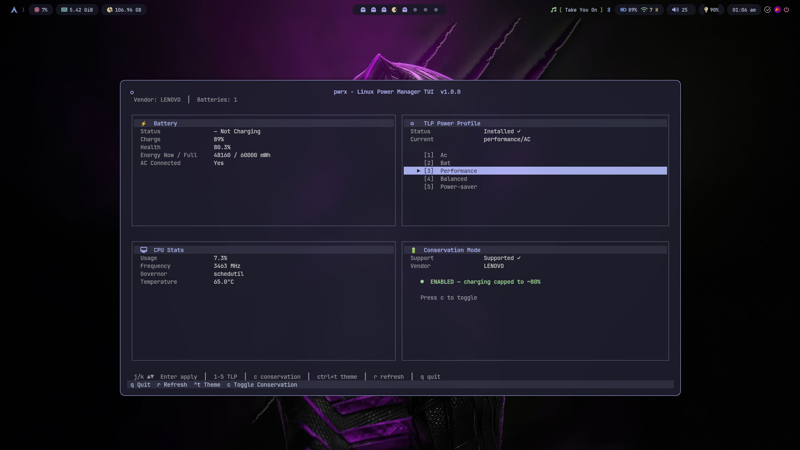<br/>
    <em>pwrx Power Utility</em>
  </span>
  <span style="display:inline-block; width:45%; text-align:center;">
    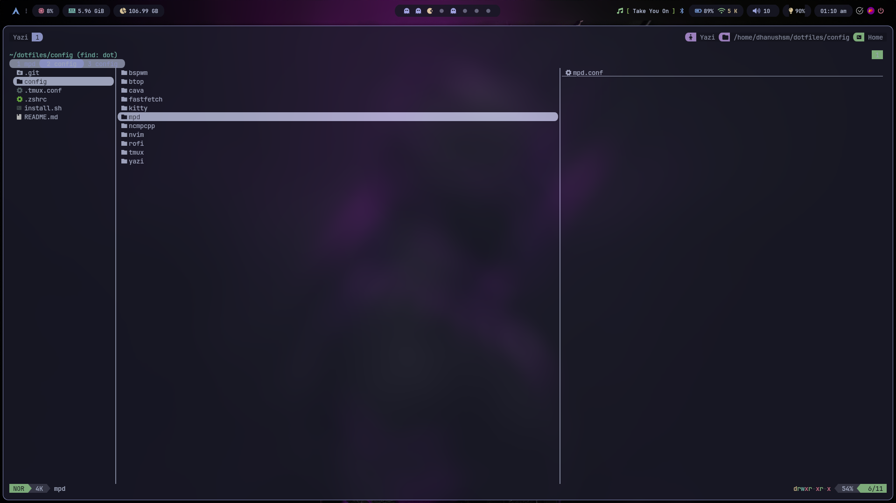<br/>
    <em>Yazi File Manager</em>
  </span>
</p>

<p align="center">
  <span style="display:inline-block; width:45%; text-align:center;">
    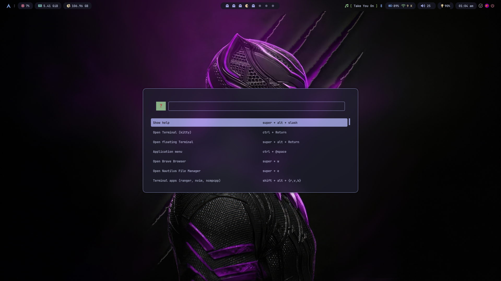<br/>
    <em>Keybindings Viewer</em>
  </span>
</p>

---

## 🤝 Contributing

- If you encounter any issues or have suggestions for improvements, feel free to open an issue or submit a pull request.

## 🙌 Credits

- **[gh0stzk](https://github.com/gh0stzk/)** - These dotfiles were inspired by his multi-theme bspwm setup, which served as a strong foundation. If you're looking for a more feature-rich and theme-diverse configuration, definitely check out his repository.
- **[Catppuccin](https://github.com/catppuccin/catppuccin)** - the only colorscheme that matters.
